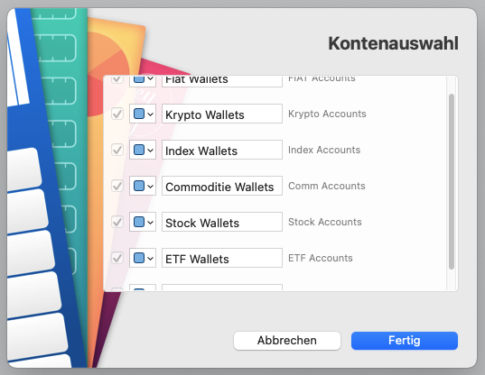

# Inofficial MoneyMoney-bitpanda-light-Extension

This bitpanda Extension for MoneyMoney only gets current balances of your bitpanda wallets.

Requirements
----------------

* [Bitpanda Account](https://www.bitpanda.com)
* Generate API-Key under your profile
* [MoneyMoney.app](https://moneymoney-app.com) (>= 2.4.3) or beta 

ToDo's
------

* more Testing
* better error handling
* For Feedback/Questions create a [ticket](https://github.com/GimliGloinsSon/MoneyMoney-bitpanda-light-Extension/issues/new)  

Installation
------------

### Signed copy from Extensions Page (preferred, but you need MoneyMoney >= 2.4.3)

1. Download a signed version of this from https://moneymoney-app.com/extensions/
  * Open MoneyMoney, tap *Hilfe* > *Zeige Datenbank*
  * put the downloaded `bitpanda-light.lua` file in the shown Extension folder
2. Add an account in MoneyMoney
  * create a new account via *Konto* > *Konto hinzufügen*.
  * Use the API-Key you created at Bitpanda profile for the API-Key

### Usigned copy from the GitHub-Repository

* Copy the `bitpanda-light.lua` file into MoneyMoney's Extension folder
  * Open MoneyMoney.app
	* Tap "Hilfe", "Show Database in Finder"
	* Copy `bitapanda-light.lua` into Extensions Folder
* Disable Signature Check (Needs beta Version!)
  * Open MoneyMoney.app
	* Enable Beta-Updates
	* Install update
	* Go to "Extensions"-tab
	* Allow unsigned extensions

Usage
-----

* For API-Key (Username in older version than 2.4.3 of MoneyMoney): API-Key from Bitpanda

* At "Kontenauswahl" you can select your:
    * FIAT wallets
    * Cryptocoin wallets
    * Index wallets
    * Commodity (metal) wallets
    * Stock wallets

Version history
---------------

* 1.1:
    * added Stock wallets

* 1.01:
    * performance improvement

* 1.0:
    * initial version
